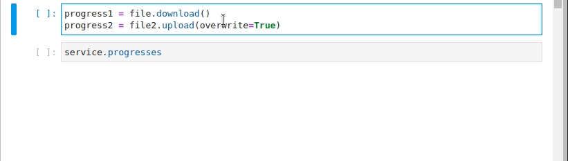

{{project_name}} {{version}} is a set of python tools that eases integration of cloud services in Python projects. 

It provides a set of tools that enhances communication and provides abstraction to developers so that they do 
not require to study the backend API -- we do that for them. 

So far, cloudspeak have languages for the following services:

| Cloud provider | Services supported | Tools provided                                | Abstractions                    |
|----------------|--------------------|-----------------------------------------------|---------------------------------|
| Azure          | Azure Blob Storage | Service, Containers, Files (blobs) and Queues | Remote dictionary, Remote Queue |
| ...            | ...                | ...                                           | ...                             |


# TOOLS

The tools provided allow communicating with the backend in a friendly manner. Example:

```python

from cloudspeak.azure import AzureCredentials, AzureFactory 

credentials = AzureCredentials()
credentials.connection_string_storage = "MY_CONNECTION_STRING"

factory = AzureFactory(credentials)

service = factory.service_storage

container = service.containers['container']
file = container['path/to/blob']

file.download().join()
content = file.data
```

Simple, right? Well, don't be fooled by the simplicity. virtually all operations
allowed by the backend can be performed, and more. You can easily download and/or upload files asynchronously, track the progress and speeds, change tags/metadata, perform queries, ...

Even Jupyter notebooks are supported:



Simple, yet powerful. Follow the [documentation](introduction.md) to know more.

# ABSTRACTIONS

Perhaps, the most interesting part of {{project_name}} are the abstractions provided. It allows to use Python common 
data structures hosted in cloud backends, providing an abstraction: you don't have to worry about how to read/write, 
how to manage concurrency, asynchronous operations, or how to track progresses. The following abstractions are available:


* **Remote Dictionary**. A common dictionary whose keys and values are stored in the cloud. Knowing the connection details to 
the backend, two processes can begin to exchange data between them by just writing or reading from the dictionary. Follow [Dictionaries](dictionaries.md) to know more.


* **Remote queues**. A common queue whose behaviour is completely handled by Azure Storage Queues. Follow [Queues](queues.md) to know more.
